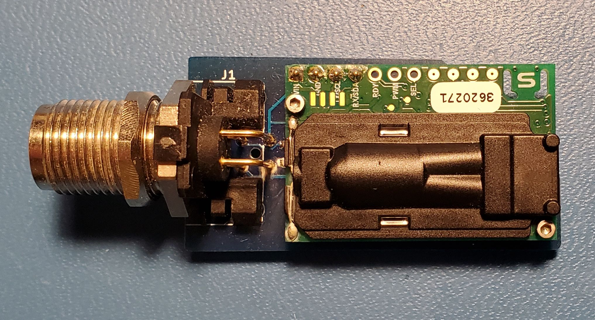
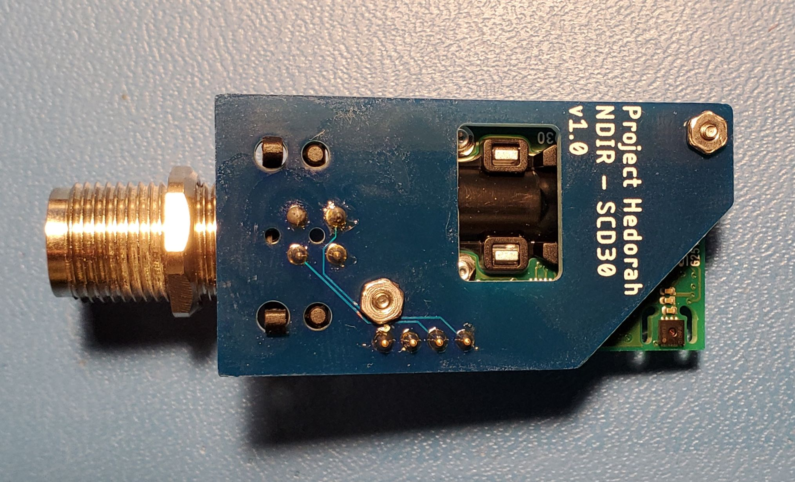
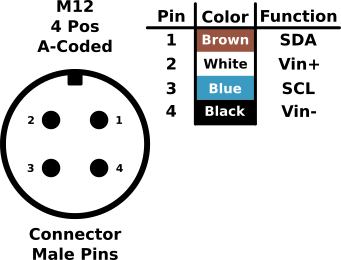

# Project-Hedorah
A hardened CO2 sensing system designed for use in unusual environments 

>[!NOTE]
> Manufacture and assembly information is discussed in detail in [DFM_-_Hedorah-NDIR](https://github.com/GEMS-sensing/DFM_-_Hedorah-NDIR)

# Repo Roadmap
#### [Documents](Documents/)

General document and image storage for repo and README

#### [Hardware](Hardware/)

Current board files (Eagle), and other electrical design documents

#### [Mechanical](Mechanical/)

Mechanical design files and assembly documents

#### [Production](Production/)

Contains the various Gerber and pick and place files required to have the Printed Circuit Boards (PCBs) manufactured or populated 

#### [Software](Software/)

The software associated with the piece of hardware, this is usually diagnostic software used for verifying or investigating the hardware

<!-- #### [Testing](Testing/)

Scripts and results from the testing process and development process. Contains more detailed information about documented issues among other testing. --> 

## Overview
* **Type:** Sensor
* **Interfaces:** I2C
<!-- * **Release Version:** v1.0 - 2021/04/14  -->

## Features
### On-Board
* Non-Dispersive InfraRed (NDIR) CO2 sensor - Sensirion SCD30
* IP68 rating (hardened sensor housing)

### Interface
* I2C data interface
* M12 circular connector 

<!--  -->

<picture>
  <source media="(prefers-color-scheme: dark)" srcset="Documents/Images/Pinout_LIGHT.png">
  
</picture>

## Specifications
#### Electrical
* **Input Voltage:** 3.3V
* **Sensor Current (Avg):** 19mA [^1]
* **Sensor Current (Max):** 75mA [^1]

[^1]: [SCD30 Datasheet](https://sensirion.com/media/documents/4EAF6AF8/61652C3C/Sensirion_CO2_Sensors_SCD30_Datasheet.pdf)

#### Sensor [^1]
**CO2**
* Range: 0 ~ 40,000 ppm CO2 
* Accuracy: &plusmn; 30 ppm + (3% Measured Value)
* Repeatability: &plusmn; 10 ppm

**Humidity**
* Range: 0 ~ 100%
* Accuracy: &plusmn; 3%
* Repeatability: 0.1%

**Temperature**
* Range: -40 ~ 70°C 
* Accuracy: &plusmn; (0.4°C + 0.023 x (Temperature [°C] - 25°C))
* Repeatability: &plusmn; 0.1°C

## Version History

**Mrk 0 - Prototype:** Breakout/development board for SGP30 eCO2 sensor

**Mrk 1 - eCO2:** Same components as Mrk 0, but arranged into a streamlined formfactor, compatable with [Haar](https://github.com/NorthernWidget-Skunkworks/Project-Haar) enclosure 

**Mrk 2 - NDIR:** Switched sensor to SCD30 NDIR sensor, moved away from Haar enclosure to custom enclosure

  * `v0.0` - Initial NDIR version, breakout only

  * `v1.0` - Added reverse polarity protection and I2C pullups

## Jumper Settings 

**Configuration Jumpers** [^2]
| Jumper | Purpose | Open | Closed | Default | 
| ------ | ------- | ---------- | ---------- | ----- | 
| `JP1` | Bypass reverse polarity protection | protection enabled | protection disabled | Open |  

[^2]: Mrk 2 only

## Known Issues/Errata

#### Vent Thread Tolerance 

**Issue:** In some cases the tolerance of the thread manufacture on the [housing body](Mechanical/HEDORAH-001_-_BetaBody/HEDORAH-001_-_BetaBody_v001.stl) can be too tight. This can be seen clearly if applying the specified torque to the vents does not screw them fully down (O-Rings making contact with the housing body). 

**Workaround:** If the issue is minor, it can be corrected by applying some plastic compatible [silicone lubricant](https://www.mcmaster.com/3025K11/) to the threads of the vent before installing - take care to only apply this to the threads and not to contaminate the vent membrane. If this is not sufficient, threads can be repaired by running an [M12x1.5mm](https://www.mcmaster.com/26015A612/) hand-tap through the holes to ensure they meet specifications.

